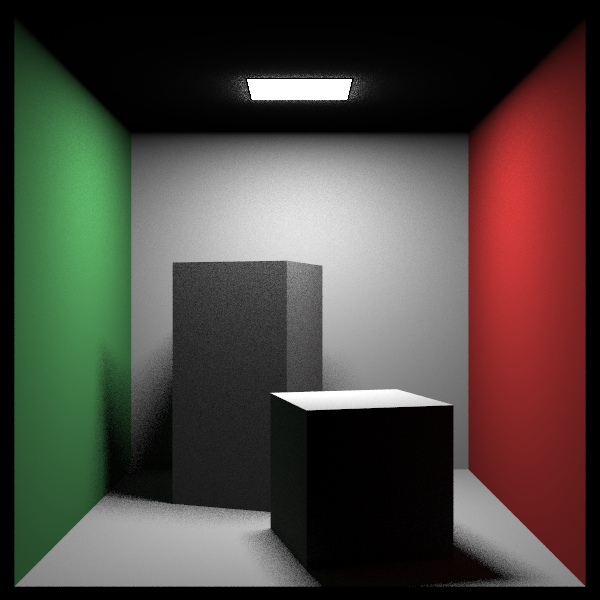
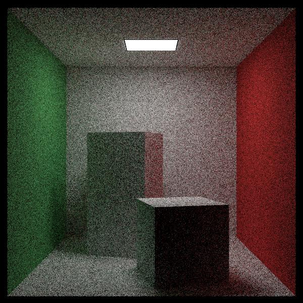

# trab2-comp-graf

> Nome: Matheus Silva
> Data: 2025-06-28

Este projeto é uma implementação de um path tracer em C++, para realizar a renderização de uma cena 3D (exemplo: Cornell Box).

## Tecnologias utilizadas:

- C++17
- OpenGL
- GLFW
- GLEW
- GLM

## Explicando meu código e o que cada trecho implementa:

1. **Estruturas matemáticas**  
   • `vec3.h` implementa o tipo `Vec3`, operador de soma, subtração, produto escalar e vetorial, normalização, além de utilidades de amostragem (vetor aleatório na esfera/unidade, direção cosseno-ponderada).  
   • Estas funções dão suporte à álgebra vetorial usada no traçado de raios.  
   • Fórmula usada para normalização:  
   \[ \hat{v}=\frac{v}{\|v\|}= \frac{v}{\sqrt{v\cdot v}} \]

2. **Ray & Câmera**  
   • `ray.h` guarda origem e direção do raio e avalia o ponto \(p(t)=o+t\,d\).  
   • `camera.h` constrói um pin-hole camera a partir de `lookfrom`, `lookat`, `vfov` e aspect-ratio.  
   • O pixel (u,v) gera um raio \(r(u,v)=o + u\,h + v\,v - o\).

3. **Hierarquia de interseção**  
   • Interface `Hittable` define método `hit`.  
   • Formas concretas: `Sphere`, `XYRect`, `YZRect`, `XZRect`, `Box`, `RotatedBox`.  
   • `HittableList` executa travessia linear agregando a interseção mais próxima.

4. **Materiais**  
   • `Lambertian` implementa um BRDF difuso constante: \(f_r = \frac{\rho}{\pi}\).  
   • Amostramos direções por cosseno no hemisfério:  
   \[ \omega_i = (\cos\phi\sqrt{r_2},\;\sin\phi\sqrt{r_2},\;\sqrt{1-r_2}) \]  
   • `DiffuseLight` representa emissores, retornando \(L_e\) e não dispersando raios.

5. **Algoritmo de Path Tracing** (`path_tracer.h`)  
   • Resolve a Equação de Renderização:  
   \[ L_o(p,\,\omega_o)=L_e(p,\,\omega_o)+ \int_{H^2} f_r(p,\omega_i,\omega_o)\,L_i(p,\omega_i)\,\cos\theta_i\,d\omega_i \]  
   • Usamos Monte Carlo:  
   \[ \hat{L}_o=\frac{1}{N}\sum_{k=1}^{N}\frac{f_r L_i\cos\theta}{p(\omega_i)} \]  
   • Profundidade mínima de 4 garantida; depois disso aplica-se Russian Roulette com probabilidade de sobrevivência \(p_s=\min(\max(\rho),0.95)\).  
   • MIS (Multiple Importance Sampling) combina:  
     – Amostragem da **luz** (geométrica), pdf \(p_L\)  
     – Amostragem da **BRDF** (coseno), pdf \(p_B\)  
     – Peso pela Heurística da Potência:  
       \[ w_L=\frac{p_L^2}{p_L^2+p_B^2},\quad w_B=\frac{p_B^2}{p_L^2+p_B^2}\]
   • A contribuição direta é:  
   \[ L_{direct}=w_L\,\rho\,\frac{L_e\,\cos\theta}{p_L} \]
   • A indireta é traçada recursivamente:  
   \[ L_{indirect}=w_B\,\rho\,\hat{L}_o^{\text{next}} \]

6. **Amostragem da Luz**  
   • `sample_light_direct` escolhe ponto aleatório no retângulo \(A_L=(x_1-x_0)(z_1-z_0)\).  
   • Converte pdf por área para pdf por sólido ângulo:  
   \[ p_L(\omega)=\frac{d^2}{A_L\,\cos\theta_L} \]  
   onde \(d\) é a distância e \(\theta_L\) o ângulo entre direção e normal da luz.

7. **Russian Roulette**  
   • Após `min_depth`, cada caminho sobrevive com \(p_s\).  
   • Se não sobreviver, retorna apenas emissão acumulada, assegurando convergência sem viés.

8. **Construção da cena (Cornell Box)** (`main.cpp`)  
   • Paredes: retângulos difusos verde, vermelho e branco.  
   • Luz: `XZRect` no teto emitindo \(L_e=(15,15,15)\).  
   • Dois blocos construídos com `RotatedBox` para gerar sombras penumbras.  
   • Câmera posicionada em (278,278,-800) com FOV 40°.

9. **Loop de renderização**  
   • Para cada pixel: acumula `samples_per_pixel` estimativas, aplica correção gama \(\gamma=2.2\).  
   • Salva PPM.

---

### Como o projeto atende ao enunciado

✔️ Geometria da cena via caixas, planos e retângulos  
✔️ Fonte(s) de luz retangulares  
✔️ Materiais difusos constantes  
✔️ Vários caminhos por pixel (parâmetro `samples_per_pixel`)  
✔️ Profundidade mínima 4 antes do Russian Roulette  

## Experimentos

A pasta `experiments/` traz um conjunto de renders que ilustram como cada técnica melhora o resultado.

### Narrativa visual

1. **Convergência de ruído** — compare `noise_50spp.png` (muito granulado) com `noise_800spp.png` (imagem limpa). A diferença mostra o papel do número de amostras na redução da variância de Monte Carlo.
2. **Importância do MIS** — `mis_off_200.png` evidencia um halo superexposto sob a lâmpada e sombras lavadas; em `mis_on_200.png` a energia direta e indireta ficam balanceadas, produzindo iluminação natural.
3. **Profundidade mínima** — em `min1_200.png` o Russian Roulette interrompe caminhos cedo demais, deixando o interior da caixa escuro. `min4_200.png` garante pelo menos quatro saltos, revelando a luz difusa rebatida nas paredes.

| Arquivo | Parâmetros | Observação |
|---------|------------|-----------|
| `noise_50spp.png` | `--samples 50` | Muito ruído, mas geometria já correta. |
| `noise_200spp.png` | `--samples 200` | Ruído bem menor, porém ainda perceptível. |
| `noise_800spp.png` | `--samples 800` | Convergência praticamente completa. |
| `mis_off_200.png` | `--samples 200 --mis_off` | Sem MIS: hotspot superexposto e sombras lavadas. |
| `mis_on_200.png`  | `--samples 200` | MIS equilibra contribuições e reduz variação. |
| `min1_200.png`    | `--samples 200 --min_depth 1` | Caminhos terminam cedo; pouca luz indireta. |
| `min4_200.png`    | `--samples 200 --min_depth 4` | Profundidade mínima garante iluminação difusa sólida. |

### Resultados visuais

<table>
<tr>
  <td align="center"><br/><sub><strong>50 spp</strong> – ruído alto</sub></td>
  <td align="center"><br/><sub><strong>200 spp</strong> – ruído moderado</sub></td>
  <td align="center"><br/><sub><strong>800 spp</strong> – convergido</sub></td>
</tr>
<tr>
  <td align="center"><br/><sub><strong>MIS OFF</strong> – hotspot e sombras lavadas</sub></td>
  <td align="center"><br/><sub><strong>MIS ON</strong> – iluminação balanceada</sub></td>
  <td></td>
</tr>
<tr>
  <td align="center"><br/><sub><strong>min depth 1</strong> – pouca luz indireta</sub></td>
  <td align="center"><br/><sub><strong>min depth 4</strong> – difusão correta</sub></td>
  <td></td>
</tr>
</table>

### Como gerar novamente

```bash
# 1) Compilar
cmake -S . -B build -DCMAKE_BUILD_TYPE=Release && cmake --build build -j$(nproc)

mkdir -p experiments

# 2) Ruído por amostra
for spp in 50 200 800; do
  ./build/path_tracer --samples $spp
  mv output.ppm experiments/noise_${spp}spp.ppm
done

# 3) MIS ON/OFF
./build/path_tracer --samples 200 --mis_off && mv output.ppm experiments/mis_off_200.ppm
./build/path_tracer --samples 200           && mv output.ppm experiments/mis_on_200.ppm

# 4) Profundidade mínima
./build/path_tracer --samples 200 --min_depth 1 && mv output.ppm experiments/min1_200.ppm
./build/path_tracer --samples 200 --min_depth 4 && mv output.ppm experiments/min4_200.ppm
```

Cada execução salva a imagem como `output.ppm`; o script renomeia para evitar sobrescrever.

> Para visualização rápida em macOS/Linux use: `open experiments/arquivo.ppm` ou converta para PNG: `convert arquivo.ppm arquivo.png` (requer ImageMagick).

Assim, o relatório mostra a evolução e demonstra o impacto de (i) número de amostras, (ii) MIS e (iii) profundidade mínima.  

